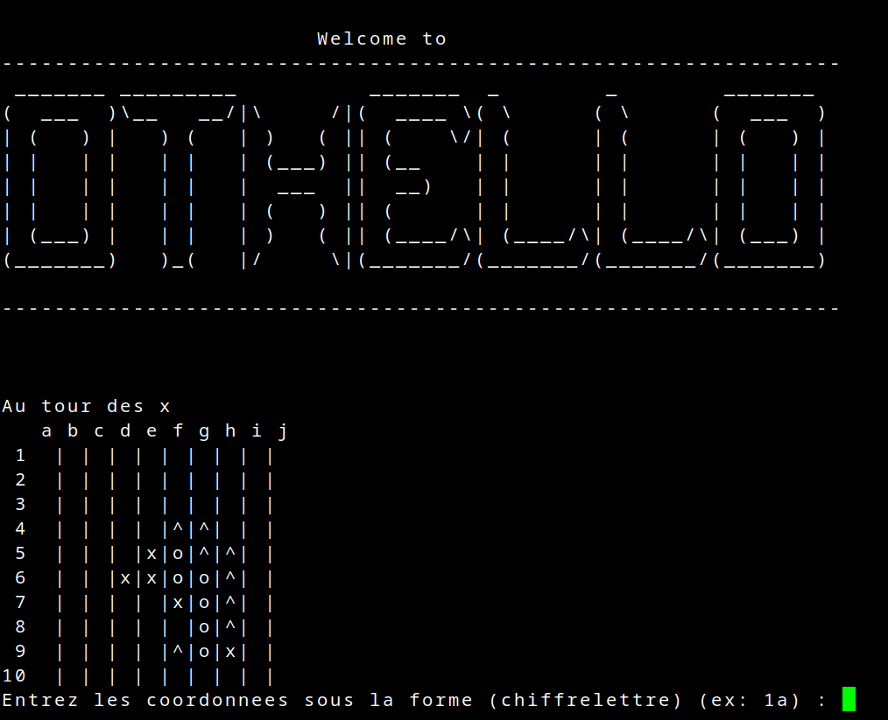

# 🕹️ Othello

Un petit jeu **Othello (Reversi)** jouable directement dans le **terminal**

Principe du jeu : encadrer les pièces de l'adversaire avec les siennes, horizontalement, verticalement ou en diagonales
Le joueur possédant le plus de pièces à la fin de la partie remporte la victoire.

---

## 🖼️ Aperçu



Le joueur ou le bot qui commence possède les pions 'o', tandis que l’adversaire utilise les pions 'x'.
Le caractère '^' indique les coordonnées où le joueur en cours peut placer un pion.

## ⚙️ Fonctionnalités

- Choix de la taille du plateau (4x4 / 8x8 / 10x10 / 12x12 / 14x14 / 16x16)
- Choix du mode de jeu (Solo / Duo)
- Si mode Solo, choix de la difficulté du bot (Facile/Difficile)
- Si mode Solo, le joueur choisit s'il commence ou non.
- Coordonnées sous la forme *chiffrelettre* (ex : **1a**)

## 🚀 Lancer le jeu

```bash
git clone https://github.com/Blackstorme07/SAE_Othello
javac -cp ./class -d ./class ./src/*.java
java -cp ./class Start Othello
```